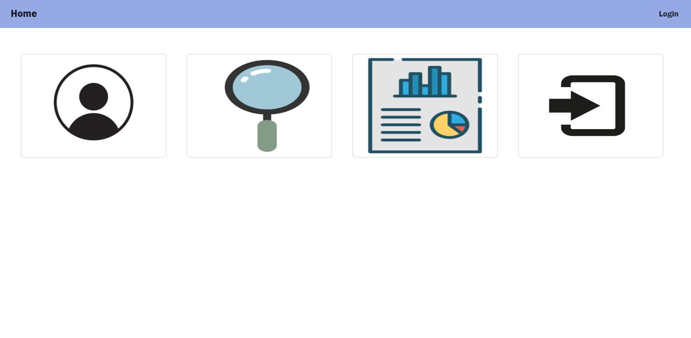

# Employee Performance Portal
  
  ## Description
  This is a space where manager can securely upload performance reports of their staff. It allows managers to document feedbacks and set goals of a particular staff to track their progress. 
  Below is a screenshot of the deployed webpage:
  

  ## Table of Contents
  - [Description](#description)
  - [Usage](#usage)
  - [Technology](#technology)
  - [Roadmap](#roadmap)
  - [Contributing](#contributing)
 
  ## Usage
  On loading the page, you will be directed to the homepage, where you have access to the login and sign up function.
  Upon logging in, the report page allows user to create new report by completing all required fields.
  The Search page retrieves and displays all reports made by the logged in user. Existing reports can be updated or deleted if required.
  "npm start" runs the app in the development mode. Open [http://localhost:3000](http://localhost:3000) to view it in your browser.
  Check out the deployed application via the link: https://stormy-wildwood-35207.herokuapp.com/

  ## Technology
  React is used in this application to create the interactive UIs. React-Bootstrap has been used for the login/Sign up Modal as well as the Report form including validation. Mongo DB and Mongoose are used for the database. Node and Express are used for backend routes. JWT is used for authentication.  

  ## Roadmap
  Future development for the project include: addition of employee database to allow users to add employees, update employee details (address, position, manager) in the portal. This will also allow the search report function to filter search by more variables such as search by manager, employee, department etc. Lastly, adding an user account page to allow password to be updated will improve user experience. 

  ## Contributing
  If you would like to contribute or collaborate with me on this project, head to my GitHub page at https://github.com/Sandy5433 to see details of the application code. If you have any comments or feedback, please reach out to me via my email sandyhung83@yahoo.com.tw  